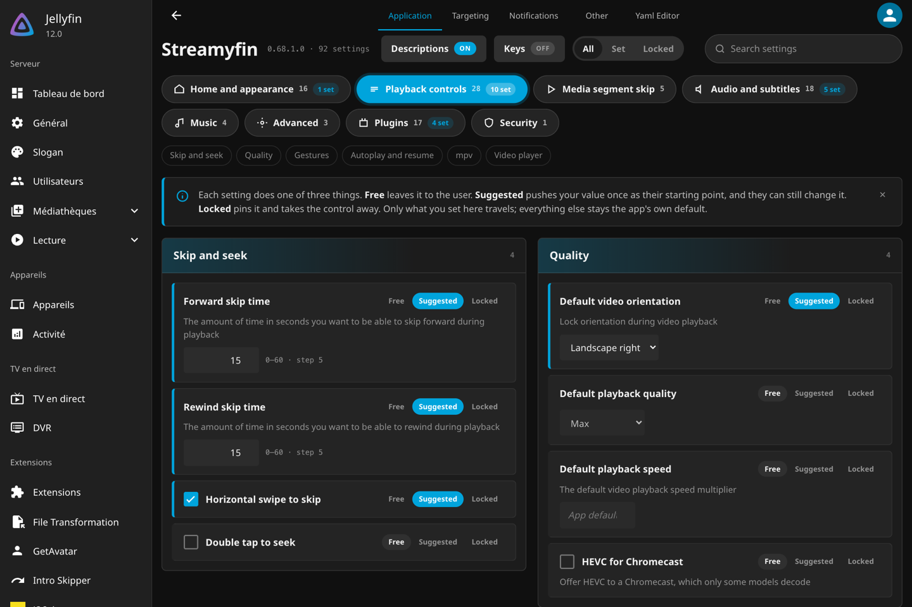
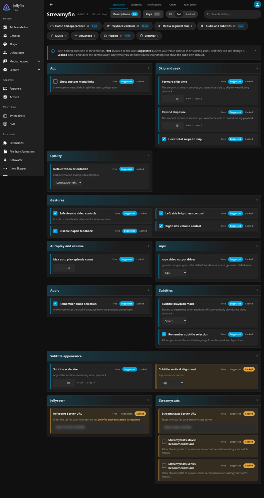
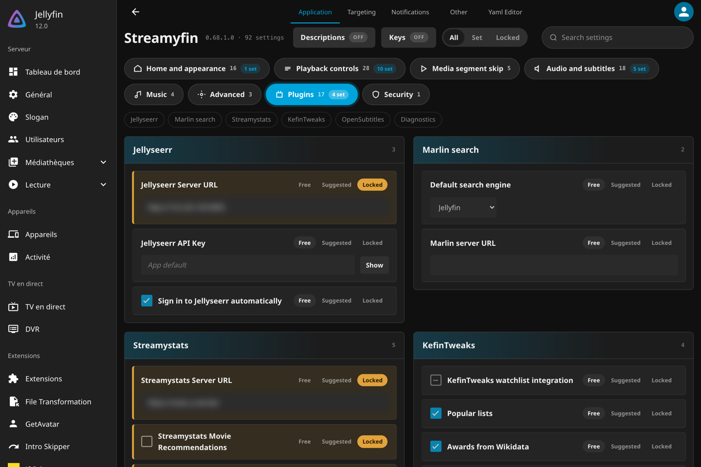
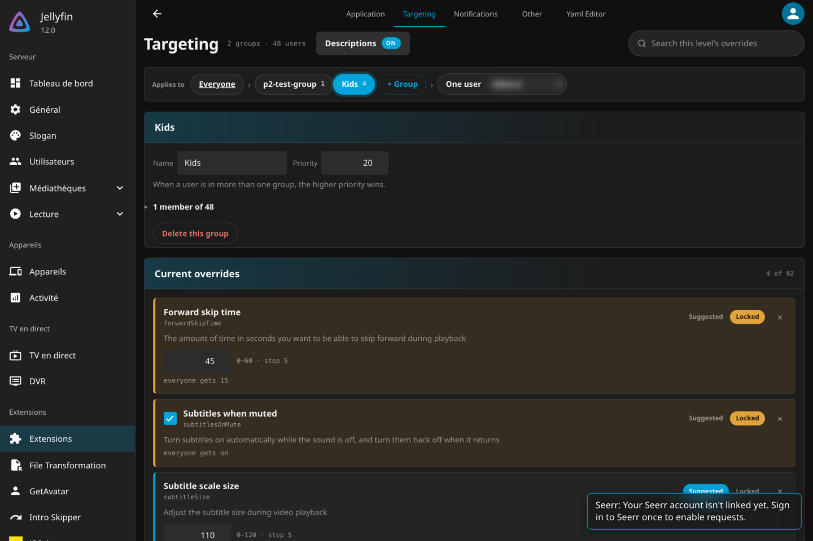
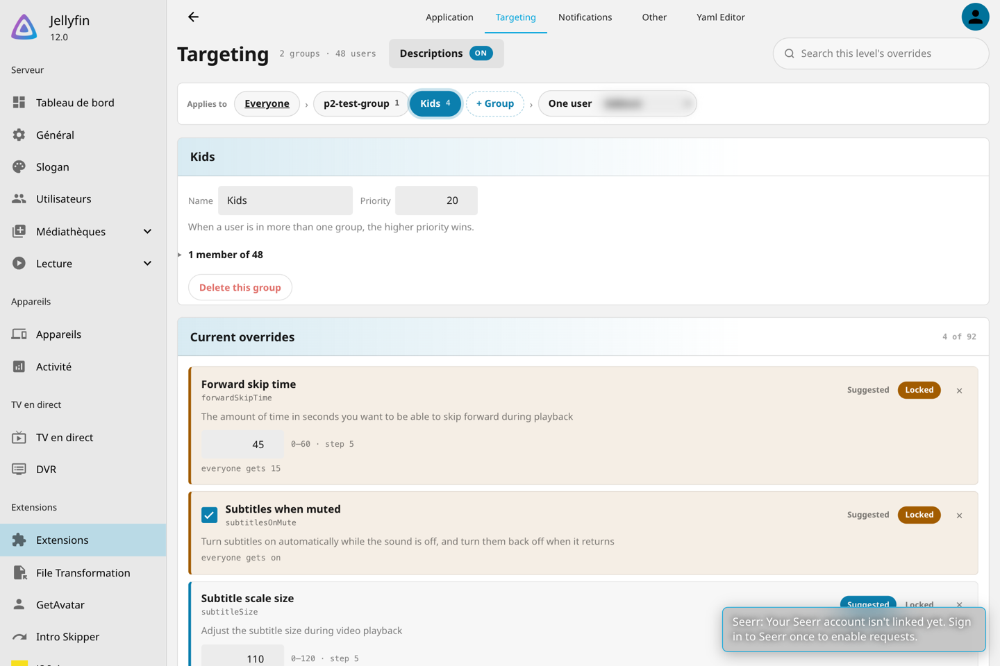
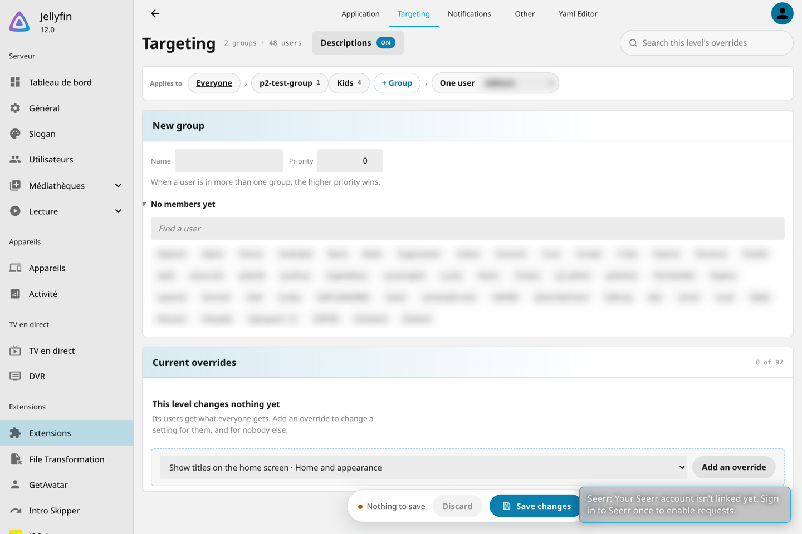

# The settings form, drawn by the plugin

This is P3.6. The Application tab stops rendering through json-editor and draws
the settings itself, from a description the server serves for that purpose. The
Targeting tab still runs on json-editor and moves onto the same renderer next;
that move, and the "Applies to" bar from the mockup that switches between the
server, a group and one user, are named at the end.

[admin-ui-references.md](admin-ui-references.md) is the audit that decided the
shape. This records what was built and what it found.

## The drift this closes

P3.1 and P3.3 got every setting in front of an administrator, which was the point.
What they got there with did not hold up:

- **The property picker never added a setting.** On the beta, ticking a setting in
  json-editor's picker rendered no field and the save carried only the keys already
  present. An override could be read and changed, never created, which is the one
  thing the Targeting tab exists for.
- **The schema was reshaped four ways for one library.** A single branch `oneOf`
  unwrapped, a nullable enum collapsed, secrets inlined as password fields, shared
  descriptions blanked. Five of the seven tests on the generated schema pinned those
  workarounds rather than anything an administrator cares about.
- **Two states where the app has three.** A `locked` checkbox says pinned or not.
  The app also distinguishes a value pushed once, that the user can still change,
  from no value at all. The form could not say which of those an unticked box meant.
- **Labels for the compiler.** Seventeen settings offered `_250KB` and `OnlyForced`.

## What the server serves

```
GET v1/settings/form
```

One entry per setting, in declaration order: key, category, group, title,
description, control, lockable, minimum, maximum, step, integer, options, dependsOn.
Built by
`SettingsForm.Describe()` on `SettingsSchema.Descriptors`, so a new setting is still
one property and its attributes and nothing here changes.

The control is decided from the value's type, in C#, where `SettingsFormTests` holds
it to account: every declared setting has one, a credential is a `Secret`, a
`Lockable<LanguagePreference>` is a `Language`, a shape with fields of its own is a
`Composite`. Bounds come from `[Bounds]` and `[Step]` on the property, both the
plugin's own attributes, where a future validator can read them too. Not
`[Range]`: see what the audit found, below.

**A bug the tests found on the way.** A dropdown's value has to be spelled the way
the store writes it, or a stored value never shows as selected. Several enums carry
an `EnumMember` value that differs from the member name: `Allow51` is stored as
`5.1`, `GpuNext` as `gpu-next`, `Left` as `left`. The first version offered the member
names. The round trip test that pins the spelling failed on `subtitleAlignX`, and the
choices now carry the `EnumMember` value.

## The three states

Every setting is in one of three states, because the app has three behaviours
(plan, P2.2):

| State | What is stored | What a user gets |
|---|---|---|
| Free | nothing | the app's own default, and the control |
| Suggested | `{ value, locked: false }` | the value once, as a starting point, and the control |
| Locked | `{ value, locked: true }` | the value, and no control |

What a save writes is the form's own answer: each setting that is set, as its pair,
and nothing for a setting left free. There is no diff against what was loaded,
because the states make the intent explicit. P3.1 needed a diff against the editor's
first value to avoid writing all 92; here free is the key's absence. Settings the
form cannot draw yet, the home layout and the library options, pass through
untouched, so a save never loses what the Yaml tab wrote.

A row's left bar is its state: amber for locked, the accent for suggested, nothing
for free. Free is what most rows say, so its button is grey; only the two states
that change something for a user carry colour.

## What a free setting shows

A free setting shows the value the user will get, which is the plugin's declared
default, the one `SettingsParityTests` keeps equal to the app's. Editing that value
makes the setting suggested with the edited value: touching it is having an opinion.

Thirty odd settings declare no default, on purpose in most cases (the mpv buffers
differ between a phone and a TV box, the languages follow the media). For those the
form does not invent one: a select shows *App default*, a switch sits in the middle,
a field is empty with the same words. Setting one without choosing a value is
invalid, Save stays off, and the row says what it needs. A setting is never written
with a value nobody chose.

## Dependencies

`[DependsOn("key")]` on a property names the toggle a setting only matters under. The
form greys the dependent setting and says why, rather than hiding it the way the app
hides it from its own users.

Only four pairs are declared, each read in the app's code rather than derived from
the names, and the test names where:

| Setting | Depends on | Where the app gates it |
|---|---|---|
| `subtitlesOnMuteAllowRestart` | `subtitlesOnMute` | passed to the mute hook under `enabled: subtitlesOnMute` |
| `audioLookaheadCount` | `audioLookaheadEnabled` | read after an early return on the toggle |
| `holdToSpeedRate` | `enableHoldToSpeed` | read after an early return on the toggle |
| `subtitleBackgroundOpacity` | `subtitleBackground` | only feeds the alpha of a background the toggle draws |

`subtitleBackgroundPadding` and `mpvCacheSeconds` looked like candidates and are not
declared: the app passes them to the native player whatever the toggle says, and
what the player does with them is not visible from the TypeScript.

The three states change what "greyed" means. A dependent setting is inert only when
its toggle is **locked off** at this level: nobody can turn it on, so the value
changes nothing. Suggested off is not inert, since a user can still turn the toggle
on and then meet the value. Inert is a look and a hint, *"Subtitles on mute" is
locked off here, so this changes nothing*; the row stays editable and validated,
since its value is still written. In every other case the hint reads *Only matters
while "Subtitles on mute" is on*.

## What a review found before the beta could

Four things a read of the diff caught that the beta pass had not exercised, each now
pinned by a test:

- **The language settings were written with the wrong spelling.** Jellyfin's cultures
  API names its fields `ThreeLetterISOLanguageName` and `DisplayName`; the config spells
  the same two `threeLetterISOLanguageName` and `displayName`, because YamlDotNet reads
  it under the camel case convention (#137). The first renderer wrote the API's
  spelling, which the server refused, and read it too, so a stored language showed as
  unset. It writes the config's spelling now and opens on either.
- **A whole number accepted a fraction.** Most numeric settings are `Lockable<int>`;
  `2.5` passed the form and the server refused it with a message that pointed at no
  field. The descriptor now says `integer`, the input steps by one, and the row says
  *Enter a whole number*.
- **An inert setting could hold Save hostage.** A dependent setting with no value,
  under a toggle locked off, was both inert (control and buttons disabled) and invalid
  (Save disabled), with no way out short of unlocking the parent. The first answer
  exempted inert rows from validation, and the review of #145 showed why that was
  wrong: an inert row's value is still written, so a cleared opacity went to the store
  as `null` on an integer. Inert now greys the row and says why but locks nothing: the
  value can be corrected, *Free* is reachable, and validation applies as everywhere
  else.
- **A refused save left the refused edit behind.** The page hands the edit to the shared
  config before posting it, since that is what the post reads. On a refusal it put the
  previous config back; before, the next showing of the tab seeded the form from the
  refused edit and counted it as saved.

## The page

One row across the top: the name, the version, the count, a *Descriptions* switch
that strips the help text once the page is known, a *Keys* switch that shows the
YAML key under each name for the hands that live in the Yaml tab, an *All / Set /
Locked* filter, and a search over every setting's title, key and description. The
filter and the search both look across every category, since "what have I set" is
a question about the whole server, and the pills stand down while either is on.
One pill per category with its count and, once anything in it is set, how many. One
chip per card inside the chosen category; a category over eight settings is
subdivided into groups, which a test holds. A banner says what the three states do
and can be dismissed for good. The cards sit in a grid that fills whatever width the
dashboard gives. A save dock appears with the first edit and stays in view at the
bottom, saying how many settings are unsaved and how many still need a value.

The page keeps the dashboard's own materials rather than a look of its own:
Jellyfin's greys and accent, its rounded grey buttons, its square checkbox with the
accent check, one boxed row per setting. Only two colours are the page's, amber for
a locked setting and the accent bar for a suggested one.







**The dashboard's theme is detected, not declared.** The audit assumed the accent
could be read from Jellyfin's own variable. Measured on both servers: the Jellyfin 12
web client defines four `--jf-*` properties in a theme stylesheet and none of them is
a colour; 10.11 defines none. So the page carries Jellyfin's greys and accent as its
own values, in a dark and a light set, and picks the set from the luminance of the
`<html>` background the theme stylesheet paints. That follows whichever of the
dashboard themes the administrator chose without naming any of them.

The dashboard keeps a plugin page's DOM between tab switches and fires `viewshow`
again. Every listener the page adds is tied to one showing and dropped on `viewhide`;
without that, a second showing saved twice.

## How it is validated

- **xUnit**, for what C# decides: `SettingsFormTests` covers the control per type, the
  choice spelling round trip, the dependencies and where they point, the bounds, and
  the wire shape the page switches on. `PluginPagesTests` holds every page resource,
  the renamed json-editor module included.
- **bun test under happy-dom**, for the renderer, which is JavaScript a browser runs
  and C# cannot see: 45 tests on what each control writes, what the three states
  write, what a free setting shows with and without a declared default, what is
  invalid, what a search or a state filter hides, what the categories count, and
  how a dependency greys. A `pages` job runs them
  in CI beside the two Jellyfin targets. This is the first JavaScript the repository
  tests; `package.json` and `bunfig.toml` exist for it and nothing else.
- **A pass on the beta**, LXC 132, Jellyfin 12.0.0, on 2026-09-02, driven through a
  real Chrome: the page renders in the dashboard with all 92 settings, the search,
  the states and the dock behave, and a setting locked from the page, saved, and read
  back after a reload is stored as `locked: true` with its value, then released and
  stored as absent.

## What the audit found

A read of the whole pull request against the rest of the plugin, on 2026-09-10,
before the merge. Four things, each fixed in the same branch:

- **The `[Range]` attributes refused every targeting write that carried a skip time.**
  ASP.NET validates every DataAnnotations attribute on a body it binds, and the
  group and user routes bind a partial `Settings`. A `[Range(0, 60)]` on a
  `Lockable<int>` property was asked whether the `Lockable` itself lay between 0
  and 60, could not convert it, and answered no. Proven on the beta: `PUT
  v1/users/{id}/settings` with `forwardSkipTime: { value: 45, locked: true }`
  answered `400 The field Forward skip time must be between 0 and 60`, and a
  setting without bounds answered 204. The Application tab never saw it, since it
  posts YAML that no model binder reads. The bounds now live on `[Bounds]`, an
  attribute of the plugin's own that nothing validates, and a test refuses any
  DataAnnotations validation attribute on a setting so the mistake stays made once.
- **The search box and the filter survived a tab switch while the form did not.**
  The dashboard keeps the page's DOM between showings, so coming back to the tab
  showed the last search and the last filter pressed over a form filtering nothing.
  Both are cleared on every showing, and on a pill, through one function.
- **A page drawn without the configuration could post one.** `shared.js` logs and
  swallows a failed fetch of the configuration and of the defaults. The page then
  drew every setting as free and, on a save, posted a configuration missing its
  notifications and its other section. It now refuses to draw without both.
- **Clearing a search or a filter came back to the first category** rather than to
  the one that was open. The pills remember it.

## What is deferred

- **A `Test` button beside an integration's URL** needs the server side probe P6.2
  plans. A button that does nothing is worse than none.
- **An Overview tab** needs the health P6.3 exposes.
- **A caveat block of its own** for the warnings that today live in a description,
  the Seerr key's for one. The description keeps them, emphasised, until the schema
  the Yaml tab reads can carry the split too.
- **A picker for id lists** such as hidden libraries, which today are typed one id
  per line. The server has the list; the form does not ask for it yet.
- **The home layout and the library options**, which are `Composite` and edited on
  the Yaml tab until P3.2.

## The Targeting tab, and the end of json-editor

The tab a level is edited on runs on this renderer too, in an **overrides mode**. The
two modes differ in what the question is:

| | Application | Targeting |
|---|---|---|
| The question | what does this server default to | what does this level change |
| What is listed | every declared setting, in its category and group | only the settings the level overrides, as one list |
| The states offered | Free, Suggested, Locked | Suggested and Locked |
| Leaving a setting alone | *Free* | the row is not there; the drop button puts it back |
| What a save writes | every setting that is not free | the level's overrides, and nothing else |

A level has no *Free* because free is the absence of the row: a group carries the
settings it means to change, and the way to stop changing one is to drop it. That is
the same contract P3.3 relied on json-editor's property picker to express, except
that picker never actually added a setting, so an override could be read and edited
and never created. Adding one is now a select and a button, the shape the audit took
from Jellyfin Enhanced's Keyboard tab.

**Each override says what it falls through to**, *everyone gets 15*, read for a
person: a choice by its label, a toggle as on or off, a list as its items, and *the
app's default* where the level above declares nothing. For a group that is the
server; for one user it is every group they belong to, applied in ascending priority,
which is the rule the server resolves by. `inherited` and `groupsFor` are the two
pure functions that say so, and they are tested.

The page is the mockup's **"Applies to"** bar and nothing else: Everyone, which links
to the Application tab, then the groups, then one user. A group's own fields sit above
its overrides, with its members folded behind a count and a filter, because a server
with forty eight users draws a wall otherwise.

With the Targeting tab moved, **json-editor is gone**: the 535 KB library, the
`legacy-settings-form.js` that wrapped it, the four schema reshapings in
`SerializationHelper` that existed only to accommodate it, and the five tests that
pinned those workarounds. The served schema is now the generated one, plus the two
markers that describe the configuration rather than a form, `x-secret` and
`x-category`. The plugin's assembly is 516 KB smaller.







## What the beta found

Two defects that only a real server could show, both fixed here:

- **A level that set the playback quality to Max lost every setting it carried.** Max
  is a null, Jellyfin's JSON options omit a null when writing, so the stored document
  lost the `value` key; reading it back tripped the required `value` on `Lockable<T>`
  and threw, the tolerant read answered null, and the level came back empty. The group
  looked saved until the page was reopened, and its members got nothing. An absent
  value now means null, which is what omitting it meant.
- **The same null was refused by the form.** The "no cap" choice arrives with no
  `value` key at all, so compared strictly against null it looked absent and Max was
  held invalid with *Choose a value*. That one reached the Application tab too. The
  test fixtures had spelled the option out as `{ value: null }`, a shape the server
  never sends; they carry the wire shape now.

## What the review of this branch found

Five more, each fixed with the change that caused it:

- **A level's list did not follow a discard.** Restoring the states put an override back
  without putting its row back, so a dropped setting stayed out of sight and one added
  since the load stayed in it.
- **The member chip could not show focus.** Its checkbox is the focusable thing and it is
  invisible, so the outline landed on nothing. The chip wears it, through
  `:focus-within` rather than `:has()`, which older clients may not read.
- **A user level still showed the group's member count.** Only the list inside the
  disclosure was hidden, not the disclosure.
- **The Descriptions switch was drawn and never wired.** It reads and writes the same
  remembered choice as the Application tab: an administrator who turned the help text
  off did so for the settings, not for one tab.
- **A showing read the wrong abort flag.** Every `viewshow` replaces the controller, so a
  run still awaiting its imports asked whichever one was current by then rather than the
  one it started with, and an abandoned run could draw over the new one. Each showing
  keeps its own.

## Delivery

Branch `refonte/p3-6-renderer`, stacked on `refonte/p3-6-form-descriptor`, one pull
request each onto `develop`, squash, body in the `Part of #114. Covers P3.6.` form
the sisters use. The tracking pull request is #121.
